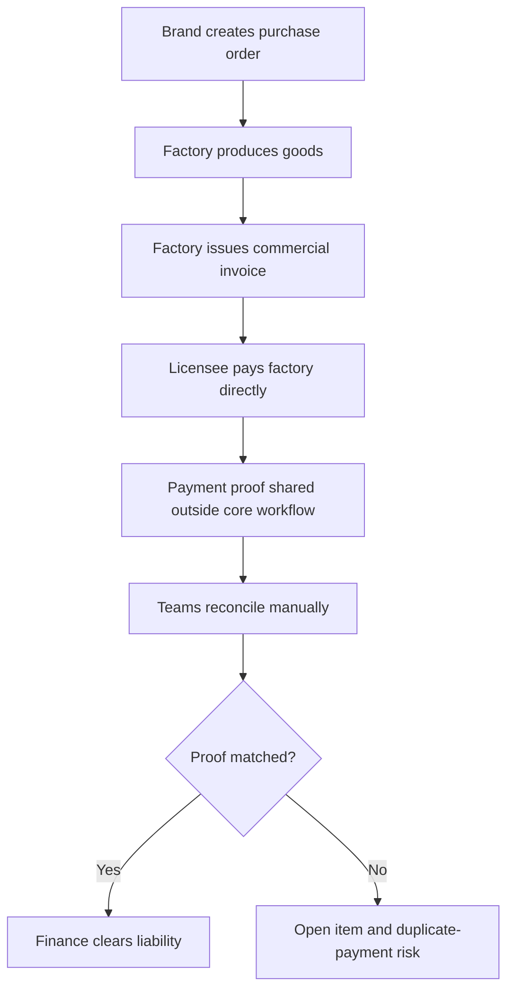
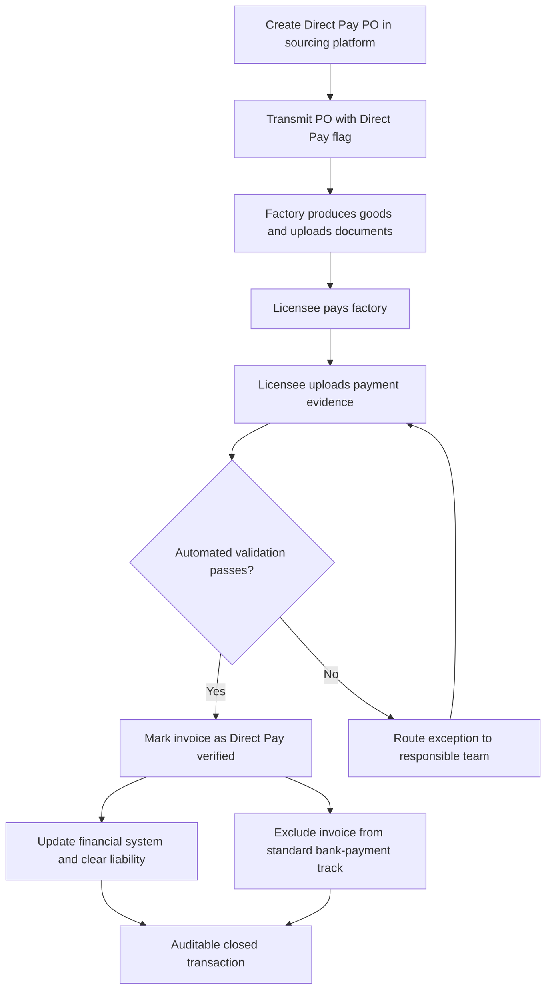
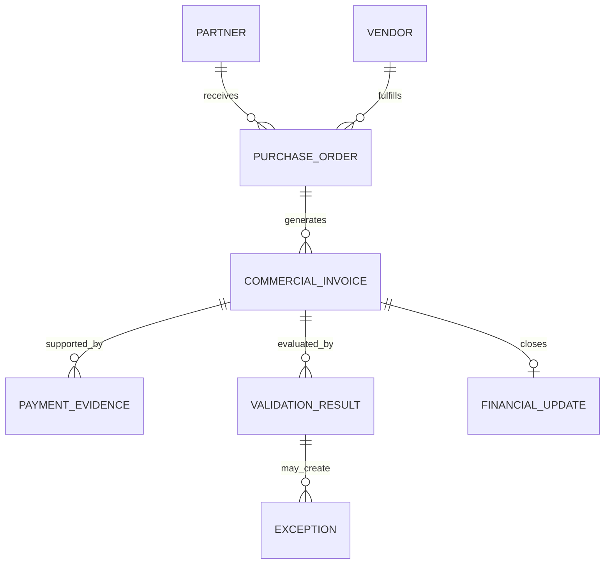
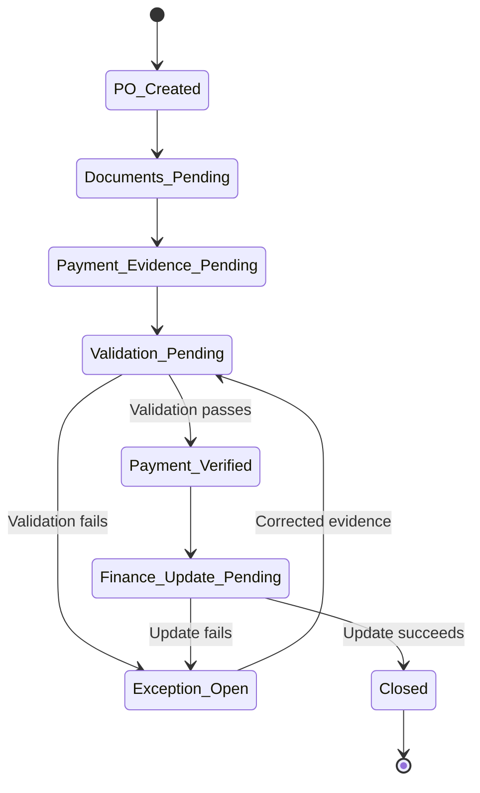

# Direct Pay: Supply Chain & Vendor Payment Optimization System

> A product case study for a cross-border sourcing and financial-reconciliation workflow that enables international licensee partners to pay factories directly while preserving payment evidence, invoice control, and enterprise-system visibility.


## Executive Summary

Direct Pay is a B2B supply-chain and financial-operations workflow designed for international sourcing arrangements in which a licensee or franchise partner pays a factory directly instead of routing the payment through the brand's standard accounts-payable process.

The commercial model already existed, but the supporting systems did not consistently capture evidence that the partner had paid the factory. That visibility gap created unresolved liabilities, manual reconciliation across multiple teams, and a risk that an invoice already paid by the partner could enter the brand's normal bank-payment process.

The solution introduces a Direct Pay designation at purchase-order creation, carries that status through the sourcing and integration ecosystem, collects structured proof of payment, validates the evidence against the applicable invoice, updates the financial system, and prevents eligible Direct Pay invoices from being sent through the standard payment track.

The initial rollout was designed around domestic-sourcing scenarios in Egypt and India, with invoice variations for markup and agent-fee handling.

## Portfolio Disclosure

This repository is a sanitized product case study based on professional experience. It documents the business problem, product reasoning, workflow design, requirements, measurement framework, and rollout approach. It does not include proprietary source code, credentials, production data, confidential commercial terms, or internal documentation. Company and partner names should be retained publicly only when authorized; otherwise, replace them with generic labels before publishing.

## The Problem

In selected international sourcing models, the brand creates the purchase order and retains operational visibility, but a regional licensee partner pays the factory directly.

The legacy process did not reliably connect four facts:

1. The purchase order was intentionally designated for Direct Pay.
2. The factory issued the correct commercial invoice.
3. The licensee partner completed payment.
4. The enterprise financial system no longer carried an open brand liability.

When payment proof was missing or disconnected from the invoice, teams had to reconcile the transaction manually across emails, documents, sourcing platforms, integrations, and finance systems.

### Business consequences

- Approximately **$400K in invoices lacked accessible payment proof during a six-month review period**.
- Previously paid invoices could remain open in the financial system.
- An invoice could be routed into the standard bank-payment track despite being paid directly by a partner.
- Logistics, Merch Compliance, Accounts Receivable, Sourcing, and Finance lacked one shared status.
- Country, partner, invoice, markup, and agent-fee variations increased exception handling.
- Manual follow-up delayed financial close and reduced confidence in outstanding-liability reporting.

## Product Objective

Create a controlled, auditable workflow that answers one question for every eligible invoice:

> **Has the correct partner paid the correct factory for the correct Direct Pay purchase order, and have all downstream systems been updated accordingly?**

### Target outcomes

- Prevent duplicate or unnecessary brand-funded payments.
- Establish traceability from purchase order through payment confirmation.
- Reduce manual reconciliation and cross-team follow-up.
- Close or clear the corresponding financial liability promptly.
- Support multiple markets and commercial-invoice structures through configuration.
- Create reusable workflow patterns for future international partners.

## Users and Stakeholders

| Actor | Role in the workflow | Primary need |
|---|---|---|
| Product / Business Analyst | Defines workflow, rules, requirements, acceptance criteria, and rollout | A scalable solution with measurable outcomes |
| Sourcing / Production | Creates and manages the purchase order | Correct Direct Pay designation and supplier instructions |
| Factory / Vendor | Produces goods and submits shipping and invoice documents | Clear PO, invoice, and documentation requirements |
| Licensee / Franchise Partner | Pays the factory directly | Simple payment-proof submission and visible status |
| Logistics | Tracks goods and supporting documentation | Accurate shipment and invoice association |
| Merch Compliance | Reviews commercial and sourcing requirements | Valid documents and exception visibility |
| Accounts Receivable / Finance | Reconciles liabilities and payment evidence | Reliable proof and accurate financial-system status |
| Integration Engineering | Moves data between sourcing, trade, and finance systems | Stable flags, mappings, validations, and error handling |
| QA | Validates scenarios across countries and invoice variants | Testable business rules and end-to-end traceability |

## Current-State Workflow



### Core failure points

| Failure point | Root cause | Product impact |
|---|---|---|
| Direct Pay intent not carried downstream | Missing or inconsistent transaction flag | Systems cannot reliably distinguish payment responsibility |
| Proof arrives by email or disconnected file | No structured evidence workflow | Manual search and weak auditability |
| Document cannot be matched confidently | Inconsistent PO, invoice, vendor, amount, or currency references | Exceptions and delayed close |
| Invoice follows normal payment track | Downstream exclusion rule is absent or fails | Potential duplicate payment |
| Finance status remains open | Proof and financial update are not connected | Inaccurate liability reporting |
| Country-specific logic is embedded manually | Workflow is not configurable | Slow rollout and higher regression risk |

## Future-State Workflow



## End-to-End Product Workflow

### 1. Configure the sourcing arrangement

The applicable market, licensee partner, factory, sourcing model, currency, markup rule, and agent-fee rule are configured before transaction processing begins.

Representative pilot patterns included:

- Egypt-to-Egypt domestic sourcing with a Middle East licensee partner.
- India-to-India domestic sourcing with an Indian licensee partner.
- Purchase orders with markup and without markup.
- Purchase orders with agent fees and without agent fees.

The product goal is to model these as configuration options rather than create a separate custom workflow for every market.

### 2. Create the Direct Pay purchase order

The brand creates the purchase order in the sourcing/product-lifecycle platform. The PO includes the normal order attributes plus an explicit Direct Pay designation.

Minimum required data:

- Purchase-order number
- Licensee / partner identifier
- Factory / vendor identifier
- Market and sourcing country
- Currency
- Direct Pay status
- Merchandise and quantity references
- Expected invoice amount or calculation basis
- Markup applicability
- Agent-fee applicability
- Required document types

### 3. Transmit the transaction downstream

The integration layer sends the PO to the trade and vendor ecosystem with a persistent Direct Pay indicator, conceptually represented as:

```xml
<DIRECT_PAY_FLAG>true</DIRECT_PAY_FLAG>
```

The exact field implementation may vary, but the rule is constant: every downstream system must be able to identify who is financially responsible for paying the factory.

### 4. Produce and document the goods

The factory produces the goods and uploads the required transaction documents, typically including:

- Commercial invoice
- Packing list
- Shipment or logistics references
- Agent documentation when applicable

The commercial invoice must be associated with the correct PO, vendor, partner, currency, and commercial scenario.

### 5. Complete the partner-to-factory payment

The licensee partner pays the factory outside the brand's normal accounts-payable route. Payment timing and settlement details must remain connected to the applicable invoice.

### 6. Upload proof of payment

The partner uploads a **Bill Retirement Advice** or other accepted bank/payment evidence into the controlled workflow.

Required evidence metadata should include:

- PO number
- Commercial-invoice number
- Payer / licensee
- Payee / factory
- Payment date
- Paid amount
- Currency
- Bank or transaction reference
- Uploaded document
- Submission timestamp
- Submitting user or organization

### 7. Validate documents and transaction data

The platform compares the submitted evidence with the PO and commercial invoice.

Suggested validation rules:

- Direct Pay flag is active.
- PO exists and is eligible.
- Partner and vendor match the PO.
- Commercial-invoice number is present and unique where required.
- Currency matches the expected currency.
- Paid amount matches the expected payable amount within approved tolerance.
- Payment date is valid.
- Proof document is attached and readable.
- Required markup is included or excluded correctly.
- Required agent fee is included or handled separately according to the scenario.
- Transaction has not already been verified or paid through another route.

### 8. Route exceptions

Transactions that fail validation enter an exception queue instead of silently proceeding.

Example exception reasons:

- Missing Bill Retirement Advice
- PO or invoice mismatch
- Vendor mismatch
- Partner mismatch
- Amount variance
- Currency mismatch
- Duplicate invoice
- Incomplete markup documentation
- Missing agent-fee documentation
- Integration failure
- Financial-system update failure

Each exception should have an owner, reason code, status, due date, history, and resolution note.

### 9. Update the financial system

After successful validation, the workflow sends the verified Direct Pay status to the enterprise financial system so that the associated liability can be cleared or closed according to accounting rules.

The update should be idempotent: retrying the same successful transaction must not create a duplicate posting or closure.

### 10. Exclude the invoice from standard payment

The standard invoice-to-bank track must skip any commercial invoice that has a valid Direct Pay designation and verified partner payment. This is the primary duplicate-payment control.

### 11. Close and retain the audit trail

The completed transaction retains:

- Source PO
- Direct Pay status
- Commercial invoice
- Packing list
- Payment evidence
- Validation result
- Exception and resolution history, if applicable
- Financial-system confirmation
- Payment-track exclusion confirmation
- User and system timestamps

## Business Rules Matrix

| Scenario | Markup | Agent fee | Expected handling |
|---|---:|---:|---|
| Domestic Direct Pay – standard | No | No | Match partner payment directly to factory invoice |
| Domestic Direct Pay – markup | Yes | No | Validate payable amount using approved markup logic |
| Domestic Direct Pay – agent-assisted | No | Yes | Validate factory payment and agent-fee treatment independently |
| Domestic Direct Pay – markup + agent | Yes | Yes | Apply both rule sets and retain separate audit evidence where required |

## Functional Requirements

### Purchase-order controls

- Authorized users can assign a Direct Pay status to eligible POs.
- Ineligible markets, partners, or vendors cannot be assigned Direct Pay accidentally.
- The Direct Pay indicator persists across integrations and document updates.
- Changes to payment responsibility are logged.

### Document management

- Vendors can upload commercial invoices and packing lists.
- Partners can upload accepted payment evidence.
- Files are linked to a specific PO and invoice.
- Required document status is visible to authorized teams.
- Replacement documents retain version history.

### Validation and exception management

- The system performs deterministic validation before marking payment verified.
- Failed validations produce actionable reason codes.
- Exceptions are routed to the correct team.
- Users can resolve, reject, or request corrected evidence.
- High-risk overrides require authorization and an audit note.

### Financial reconciliation

- Verified Direct Pay events update the financial system.
- Successful updates generate confirmation.
- Failed updates are retried safely and surfaced for action.
- Direct Pay invoices are prevented from entering the normal bank-payment file.

### Reporting

- Teams can view PO, invoice, evidence, validation, exception, and closure status.
- Aging reports identify missing proof and unresolved exceptions.
- Dashboards distinguish initiated, documented, verified, financially closed, and failed transactions.

## Non-Functional Requirements

- **Security:** Role-based access to payment documents and financial data.
- **Auditability:** Immutable history of status changes, uploads, approvals, and overrides.
- **Reliability:** Safe retry behavior across integrations.
- **Data quality:** Standard identifiers and controlled reason codes.
- **Scalability:** Configuration-driven onboarding for new markets and partners.
- **Observability:** Alerts for interface failures, aging transactions, and abnormal volumes.
- **Privacy:** Retention and access rules appropriate for bank and payment evidence.
- **Performance:** Near-real-time status updates where integrations support them.

## Conceptual Data Model



## State Model



## Example User Stories

### Partner

> As a licensee partner, I want to upload payment evidence against the correct invoice so that the brand can confirm the factory was paid without asking me to resend documents by email.

### Finance

> As a finance user, I want verified Direct Pay invoices removed from the brand-funded payment track so that the same factory invoice is not paid twice.

### Compliance

> As a compliance user, I want failed validations categorized by reason so that I can resolve the highest-risk exceptions first.

### Product operations

> As a product-operations user, I want to see transaction aging by workflow stage so that I can identify whether delays come from missing documents, failed validation, or downstream integration errors.

## Sample Acceptance Criteria

### Direct Pay flag propagation

```gherkin
Given an eligible purchase order is marked as Direct Pay
When the purchase order is transmitted to the trade integration layer
Then the downstream transaction includes the Direct Pay indicator
And the receiving system associates it with the correct purchase order
```

### Duplicate-payment prevention

```gherkin
Given a Direct Pay commercial invoice has verified partner payment evidence
When the standard bank-payment file is generated
Then the invoice is excluded from that payment file
And the exclusion is recorded in the transaction audit history
```

### Exception creation

```gherkin
Given the payment amount does not match the expected invoice amount
When validation runs
Then the transaction is not marked as verified
And an amount-variance exception is assigned to the appropriate queue
```

## Product Metrics

### North-star outcome

**Direct Pay invoices reconciled correctly without duplicate payment or manual intervention.**

### Funnel metrics

1. Direct Pay POs created
2. Commercial invoices received
3. Payment evidence received
4. Evidence automatically validated
5. Financial liabilities successfully closed
6. Invoices successfully excluded from the standard payment track

### Operating metrics

| Category | Metric |
|---|---|
| Adoption | Eligible POs using the Direct Pay workflow |
| Completion | Percentage of Direct Pay invoices with complete proof |
| Automation | Straight-through processing rate |
| Speed | Median time from partner payment to verified status |
| Finance | Median time from verification to liability closure |
| Exceptions | Exceptions per 100 invoices |
| Quality | First-pass validation rate |
| Risk | Duplicate payments prevented / duplicate-payment rate |
| Data | Unmatched invoices and missing-proof aging |
| Scale | Transactions processed per manual touch |

### Baseline and projected value

- **Observed problem baseline:** approximately $400K in invoices without accessible proof during a six-month period.
- **Projected risk reduction:** removal of approximately $400K in duplicate-payment exposure represented by that baseline, subject to realized rollout results.
- **Projected commercial benefit:** approximately $500K in annual duty savings associated with the intended sourcing/payment model, subject to finance validation and actual transaction volume.
- **Operational benefit:** reduced document chasing, reconciliation effort, exception aging, and financial-close delays.

These figures are business-case estimates and should not be presented as realized outcomes until confirmed through post-launch reporting.

## Rollout Strategy

### Phase 1 — Discovery and control design

- Map current PO-to-payment journey.
- Identify system and team handoffs.
- Quantify missing-proof and duplicate-payment exposure.
- Define Direct Pay eligibility and document rules.
- Align Finance, Logistics, Compliance, Sourcing, Product, and Engineering.

### Phase 2 — Pilot configuration

- Configure one domestic-sourcing market and partner.
- Enable the Direct Pay PO designation.
- Add payment-evidence submission.
- Implement invoice matching and exclusion controls.
- Establish exception ownership and monitoring.

### Phase 3 — QA and reconciliation testing

- Test positive and negative paths.
- Cover markup/no-markup and agent-fee/no-agent-fee scenarios.
- Validate source-to-target field mappings.
- Confirm financial-system closure.
- Confirm exclusion from the standard bank-payment track.
- Reconcile pilot results manually before broader expansion.

### Phase 4 — Controlled launch

- Release to a small set of transactions.
- Monitor every transaction end to end.
- Compare system results with Finance records.
- Review exception reasons daily during stabilization.
- Resolve workflow and training gaps.

### Phase 5 — Market expansion

- Convert pilot rules into reusable configuration.
- Add the next market or licensee partner.
- Measure implementation lead time and straight-through processing.
- Create a repeatable onboarding and regression-test package.

## Test Scenarios

| Test | Expected result |
|---|---|
| Valid Direct Pay PO, matching invoice and proof | Transaction verifies and financial liability closes |
| Missing proof | Transaction remains pending and appears in aging report |
| Incorrect PO on evidence | Validation fails with PO-mismatch reason |
| Amount outside tolerance | Validation fails with amount-variance reason |
| Currency mismatch | Validation fails and routes to Finance/Compliance |
| Duplicate invoice | Second record is blocked or flagged |
| Markup scenario | Expected payable amount reflects configured markup rule |
| Agent-fee scenario | Agent fee follows its configured validation/accounting treatment |
| Downstream finance interface failure | Transaction remains retryable and visible; no false closure |
| Standard payment-file generation | Verified Direct Pay invoice is excluded |
| Replayed successful message | No duplicate posting occurs |

## Key Risks and Controls

| Risk | Control |
|---|---|
| Duplicate factory payment | Direct Pay flag, verified evidence, and payment-file exclusion |
| Fraudulent or incorrect proof | Required metadata, document review, matching rules, and override controls |
| Wrong invoice association | PO/vendor/partner/invoice/amount/currency validation |
| Integration message loss | Monitoring, retries, reconciliation reports, and idempotency |
| False financial closure | Closure only after successful validation and downstream confirmation |
| Country-specific complexity | Configuration-driven rules and market-level QA |
| Excessive manual work | Reason-coded exceptions and progressive automation |
| Unauthorized document access | Role-based access and audit logs |
| Unverified savings claim | Finance-approved baseline and post-launch measurement |

## Product Decisions and Tradeoffs

### Configure versus customize

The workflow should support country and partner variations through reusable rules. A separate custom build for every partner would slow expansion and raise maintenance costs.

### Automation versus financial control

High-confidence matches can move through straight-through processing. Ambiguous amounts, identity mismatches, and overrides should remain human-reviewed until sufficient evidence supports safe automation.

### Speed versus auditability

Faster reconciliation matters, but every automatic decision must retain the documents, inputs, rules, and timestamps needed for financial review.

### Pilot scope versus completeness

The pilot should cover enough invoice variations to validate the architecture without attempting to support every international sourcing scenario in the first release.

## My Product Management Contribution

My role focused on converting a fragmented financial and supply-chain problem into an executable product workflow. Responsibilities included:

- Mapping the current-state journey across sourcing, partner payment, documentation, integrations, and financial reconciliation.
- Identifying the missing-proof and duplicate-payment failure modes.
- Translating business and finance needs into workflow requirements, business rules, user stories, acceptance criteria, and test scenarios.
- Aligning stakeholders across Product, Sourcing, Logistics, Merch Compliance, Accounts Receivable, Finance, Engineering, Integration, and QA.
- Structuring country, markup, and agent-fee variations into testable scenarios.
- Supporting QA, pilot readiness, exception review, and rollout planning.
- Defining the measurement framework for reconciliation speed, automation, risk reduction, and financial value.
- Keeping the solution focused on a repeatable capability that could expand to additional markets and partners.

## What I Learned

- A payment workflow is only complete when operational documents and financial-system status agree.
- A single transaction flag can become a critical control when it persists reliably across every downstream system.
- International scale comes from configurable business rules, not repeated custom implementations.
- Exception design is part of the product, not a post-launch support problem.
- Projected savings must be separated from measured results and validated after launch.
- The strongest product outcome connects customer usability, operational efficiency, financial accuracy, and risk reduction.

## Product Roadmap

### Near term

- Stabilize pilot transaction paths.
- Improve exception reason codes and ownership.
- Add aging and reconciliation dashboards.
- Validate projected savings with Finance.

### Medium term

- Expand to additional partners and domestic-sourcing markets.
- Increase automated invoice/evidence matching.
- Add partner-facing status and correction workflows.
- Standardize onboarding, configuration, and regression testing.

### Longer term

- Introduce anomaly detection for unusual amounts, duplicate documents, and delayed proof.
- Predict exceptions before payment or shipment milestones.
- Create self-service market/partner configuration with governance.
- Build portfolio-level financial-risk and working-capital insights.

## Repository Purpose

This repository demonstrates product-management capability across:

- Enterprise workflow discovery
- Supply-chain and financial systems thinking
- Cross-functional stakeholder alignment
- Requirements and acceptance-criteria development
- Integration and data-flow design
- Risk and control design
- Pilot planning and market expansion
- Product analytics and value measurement

## Suggested Repository Structure

```text
direct-pay/
├── README.md
├── docs/
│   ├── product-requirements.md
│   ├── workflow-and-business-rules.md
│   ├── user-stories-and-acceptance-criteria.md
│   ├── test-plan.md
│   ├── metrics-framework.md
│   └── rollout-plan.md
├── diagrams/
│   ├── current-state.png
│   ├── future-state.png
│   └── data-model.png
└── LICENSE
```

## Interview Summary

> I worked on Direct Pay, a supply-chain and financial-reconciliation product for international licensee sourcing. The business allowed partners to pay factories directly, but payment proof did not consistently flow through the enterprise systems. That created manual reconciliation, unresolved liabilities, and potential duplicate-payment exposure. I helped map the end-to-end workflow, define the Direct Pay PO flag, payment-evidence requirements, validation rules, exception handling, financial-system updates, and exclusion from the normal bank-payment track. The pilot was structured around domestic sourcing in Egypt and India, including markup and agent-fee scenarios. The business case targeted approximately $500K in annual duty savings while addressing roughly $400K of invoices that lacked accessible proof during a six-month baseline. The most important product lesson was that scale requires configurable market rules and straight-through processing—not a new manual process for every partner.

## Disclaimer

This case study is for portfolio and educational purposes. All workflows are presented at a generalized product-design level. Sensitive implementation details, production data, internal identifiers, and confidential commercial information are intentionally excluded. Business-case figures are labeled as observed baselines or projections and should be updated if verified post-launch results become publicly shareable.

